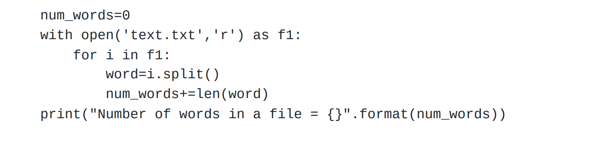

# Word-count
## AIM:
To write a python program for getting the word count from a text.
## EQUIPEMENT'S REQUIRED: 
PC
Anaconda - Python 3.7
## ALGORITHM: 
### Step 1:Define the variable to count the number of words in the file and defined with 0.

### Step 2:Open the text file using the open keyword.
 
### Step 3:Using r command i.e:read mode.

### Step 4:Using for loop to iterate file to split the space in the words.

### Step 5:It is splitted and stored in the variable,Use len() function of the splitted word variable.

### Step 6:End the Program

## PROGRAM:
```
Developed By:karna s
RegisterNumber:22008977
```

### OUTPUT:


## RESULT:
Thus the program is written to find the word count from a text.
